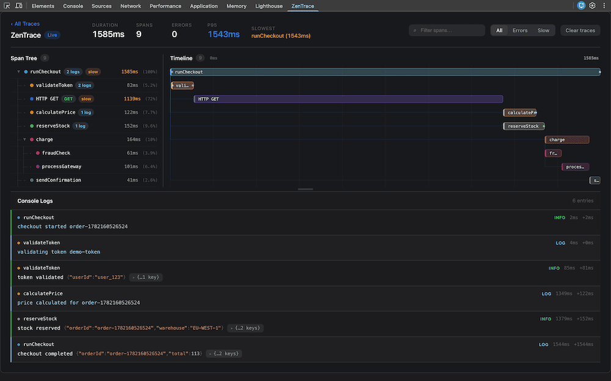
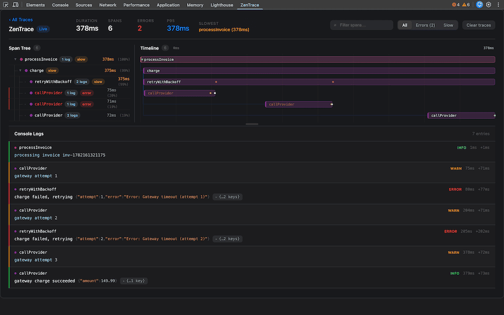
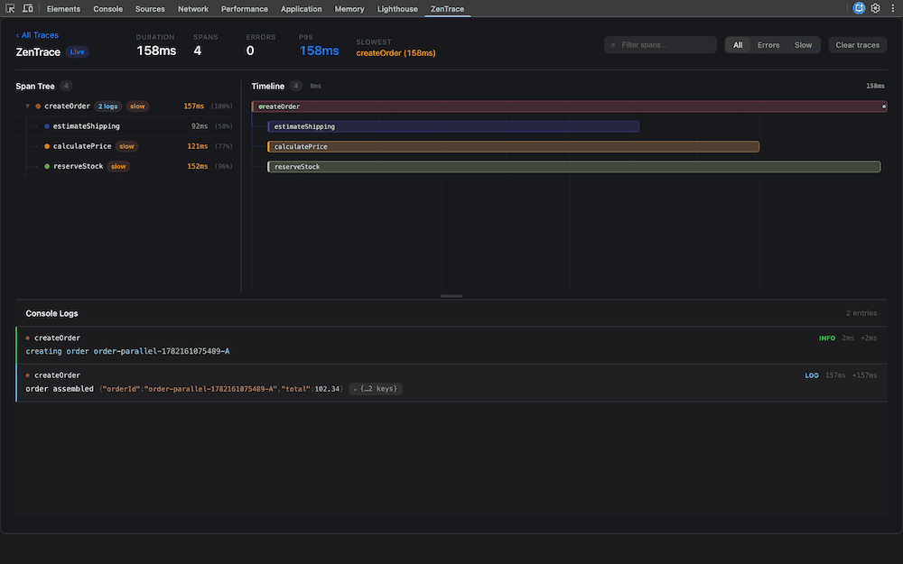
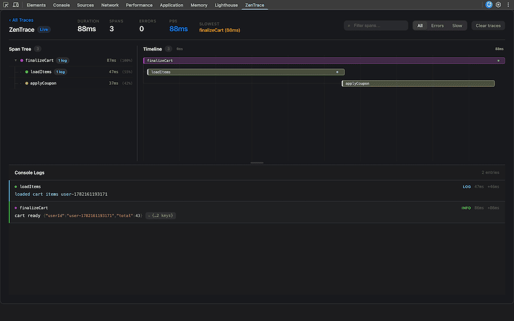
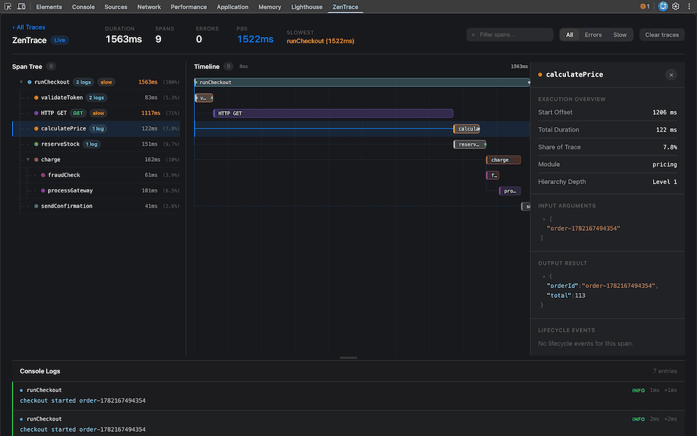

# ZenTrace

Trace function calls, async flow, logs, and HTTP — see it in Chrome DevTools.

[npm version](https://www.npmjs.com/package/zentrace)

## The problem

Async JavaScript is hard to debug. A bug in `checkout()` might come from
`validateUser()`, a slow `fetch`, or a `console.log` three layers deep — but
the stack trace only shows where it crashed, not how data got there.

## What you get

Decorate class methods with `@trace()`, wrap plain functions with `traceFn()`,
run the app, open the **ZenTrace** panel in Chrome DevTools.

|                 |                                               |
| --------------- | --------------------------------------------- |
| **Span tree**   | which function called which                   |
| **Timeline**    | how long each step took                       |
| **Inspector**   | arguments, return values, `setAttribute` tags |
| **Logs + HTTP** | `console.*` and `fetch` linked to spans       |

```bash
npm install zentrace
```

## Quick start

Call `configureZenTrace({ capture: true })` once at startup so arguments and
return values show in the inspector. Pass the parent `Span` as the last
argument of every traced child — that is how the tree is built.

### Classes — `@trace()`

```ts
import { configureZenTrace, Span, trace } from 'zentrace'

configureZenTrace({ capture: true })

class CheckoutService {
  @trace({ name: 'checkout' })
  async checkout(orderId: string, span?: Span) {
    span?.setAttribute('orderId', orderId)
    const user = await this.getUser(orderId, span!)
    return this.charge(user.id, span!)
  }

  @trace({ name: 'getUser' })
  async getUser(orderId: string, span: Span) {
    span.setAttribute('orderId', orderId)
    return { id: 'user_123' }
  }

  @trace({ name: 'charge' })
  async charge(userId: string, span: Span) {
    span.setAttribute('userId', userId)
    return { paid: true }
  }
}
```

### Functions — `traceFn()`

Use `traceFn()` when you are not using classes. The API is the same: last
argument is the parent span, `setAttribute` tags the hop.

```ts
import { configureZenTrace, Span, traceFn } from 'zentrace'

configureZenTrace({ capture: true })

const getUser = traceFn(
  async (orderId: string, span?: Span) => {
    span?.setAttribute('orderId', orderId)
    return { id: 'user_123' }
  },
  { name: 'getUser' },
)

const checkout = traceFn(
  async (orderId: string, span?: Span) => {
    span?.setAttribute('orderId', orderId)
    const user = await getUser(orderId, span)
    return { orderId, userId: user.id }
  },
  { name: 'checkout' },
)
```

You can mix both in the same app. A `@trace()` method can call a `traceFn()`
helper (and the other way around) as long as you pass the parent `Span`.

Omitting the parent span starts a **new root trace**.

## Chrome extension

The panel ships as a Chrome DevTools extension in this repo (not on the Chrome
Web Store yet).

```bash
pnpm build:extension
```

1. Open `chrome://extensions/`
2. Enable **Developer mode**
3. **Load unpacked** → select the `extension/` folder
4. Run your app and open DevTools → **ZenTrace**

`pnpm dev:demo` runs an instrumented playground if you want to click through
the examples below.

## Examples

| File                                                                 | Run function                      | What you see                             |
| -------------------------------------------------------------------- | --------------------------------- | ---------------------------------------- |
| [examples/checkout.ts](examples/checkout.ts)                         | `runCheckoutExample()`            | Deep tree, HTTP, parallel branches, logs |
| [examples/trace-fn-cart.ts](examples/trace-fn-cart.ts)               | `runTraceFnCartExample()`         | `traceFn()` without classes              |
| [examples/parallel-order.ts](examples/parallel-order.ts)             | `runParallelOrderExample()`       | Sibling spans on the timeline            |
| [examples/error-retry.ts](examples/error-retry.ts)                   | `runErrorRetryExample()`          | Failed attempts, retries, error logs     |
| [examples/concurrent-checkouts.ts](examples/concurrent-checkouts.ts) | `runConcurrentCheckoutsExample()` | Three separate root traces               |









Copy a file into your app and call the `run*` function from a button click so
each invocation is one trace.

Tag each hop with `span.setAttribute(...)` (`orderId`, `userId`, `total`, …),
not only the root. That is what the inspector and Zipkin show.

## Inspector

Select a span in the tree or timeline. The side panel shows:

- **Timing** — start offset, duration, share of the trace
- **Attributes** — everything from `setAttribute`
- **Input / output** — when capture is on (`configureZenTrace({ capture: true })`
  or `captureArgs` / `captureResult` on that function)
- **Lifecycle** — logs and events on that span



## Optional: structured logging

`setLogger` routes `span.console.*` through Pino, Winston, or another logger
using Pino’s `(bindings, message)` shape. Object arguments stay as JSON
fields — they are never stringified into `message`.

```ts
import pino from 'pino'
import { setLogger } from 'zentrace'

const p = pino()

setLogger({
  info: p.info.bind(p),
  error: p.error.bind(p),
  debug: p.debug.bind(p),
  warn: p.warn.bind(p),
})

// span.console.log('checkout completed', { orderId, total })
// → p.info({ orderId, total, correlationId, traceId, spanId, ... }, 'checkout completed')
```

Winston uses `(message, meta)`, so wrap it:

```ts
import winston from 'winston'
import { setLogger } from 'zentrace'

const logger = winston.createLogger({
  transports: [new winston.transports.Console()],
})

setLogger({
  info: (bindings, message) =>
    typeof bindings === 'string'
      ? logger.info(bindings)
      : logger.info(message ?? '', bindings),
  error: (bindings, message) =>
    typeof bindings === 'string'
      ? logger.error(bindings)
      : logger.error(message ?? '', bindings),
  debug: (bindings, message) =>
    typeof bindings === 'string'
      ? logger.debug(bindings)
      : logger.debug(message ?? '', bindings),
})
```

## Optional: Zipkin and Loki

Call these once at process startup, next to `configureZenTrace()`.
[examples/checkout.ts](examples/checkout.ts) shows the full setup.
Fetch is traced automatically when a `@trace` / `traceFn` span starts.

```ts
import { enableZipkinExport } from 'zentrace/exporters/zipkin'
import { enableLokiExport } from 'zentrace/exporters/loki'

enableZipkinExport({
  endpoint: 'http://localhost:9411/api/v2/spans',
  serviceName: 'checkout-api',
})

enableLokiExport({
  endpoint: 'http://localhost:3100/loki/api/v1/push',
  serviceName: 'checkout-api',
  labels: { environment: 'development' },
  nestFields: true,
})
```

Defaults are local Zipkin (`9411`) and Loki (`3100`) if you omit `endpoint`.
A second call with the same exporter **replaces** the previous one. Use
`disableZipkinExport()` / `disableLokiExport()` to stop sending.

| Option        | Zipkin | Loki | Notes                                                               |
| ------------- | ------ | ---- | ------------------------------------------------------------------- |
| `endpoint`    | ✓      | ✓    | HTTP POST destination                                               |
| `serviceName` | ✓      | ✓    | Zipkin `localEndpoint`; Loki `service_name` label                   |
| `authToken`   | ✓      | ✓    | Full `Authorization` value, e.g. `Bearer ${process.env.TOKEN}`      |
| `headers`     | ✓      | ✓    | Extra request headers                                               |
| `labels`      |        | ✓    | Low-cardinality stream labels only (`environment`, `cluster`, …)    |
| `tenantId`    |        | ✓    | Grafana Cloud / multi-tenant Loki (`X-Scope-OrgID`)                 |
| `nestFields`  |        | ✓    | Put dynamic payload under `fields` (Grafana JSON is easier to scan) |

Zipkin receives one v2 span per finished function. It never sends
`zentrace.logs`, captured `input` / `output` from `captureArgs` /
`captureResult`, or the auto-traced `HTTP <method>` spans. Those stay in Loki
and DevTools.

`setAttribute('input', …)` / `setAttribute('output', …)` is the only way those
keys reach Zipkin — captured decorator I/O does not.

Loki receives `span.console.*` lines plus, when capture is on, a structured
`event: "span"` line with parsed `input` / `output`.

Log JSON uses OpenTelemetry-style `trace_id`, `span_id`, `parent_span_id`, and
`span_name`. Configure a Grafana Loki derived field on `trace_id` that links
to your Zipkin data source. Do not put trace IDs in Loki `labels` — that
creates a high-cardinality stream per trace.

## Playwright

See [docs/usage/playwright.md](docs/usage/playwright.md) to attach the current
test name to each trace (`attachZenTrace`).

## API

```ts
import {
  configureZenTrace,
  trace,
  traceFn,
  type Span,
} from 'zentrace'
import { attachZenTrace } from 'zentrace/playwright'
import { enableZipkinExport } from 'zentrace/exporters/zipkin'
import { enableLokiExport } from 'zentrace/exporters/loki'

configureZenTrace({ capture: true })

@trace({ name: 'checkout' }) // span name; defaults to the method name
traceFn(fn, { name: 'loadItems' })
```

| Call                            | Use when                                        |
| ------------------------------- | ----------------------------------------------- |
| `@trace(options?)`              | Class methods                                   |
| `traceFn(fn, options?)`         | Plain functions / arrow functions               |
| `span.setAttribute(key, value)` | Tags for inspector + Zipkin                     |
| `span.console.*`                | Logs tied to that span (and Loki / `setLogger`) |

## Contributing

Contributions are welcome — bug reports, docs, examples, and code.

| Resource           | Link                                       |
| ------------------ | ------------------------------------------ |
| Contributing guide | [CONTRIBUTING.md](./CONTRIBUTING.md)       |
| Code of conduct    | [CODE_OF_CONDUCT.md](./CODE_OF_CONDUCT.md) |
| Security policy    | [SECURITY.md](./SECURITY.md)               |
| License            | [MIT](./LICENSE)                           |

Open an issue using the bug or feature templates, or submit a pull request.
